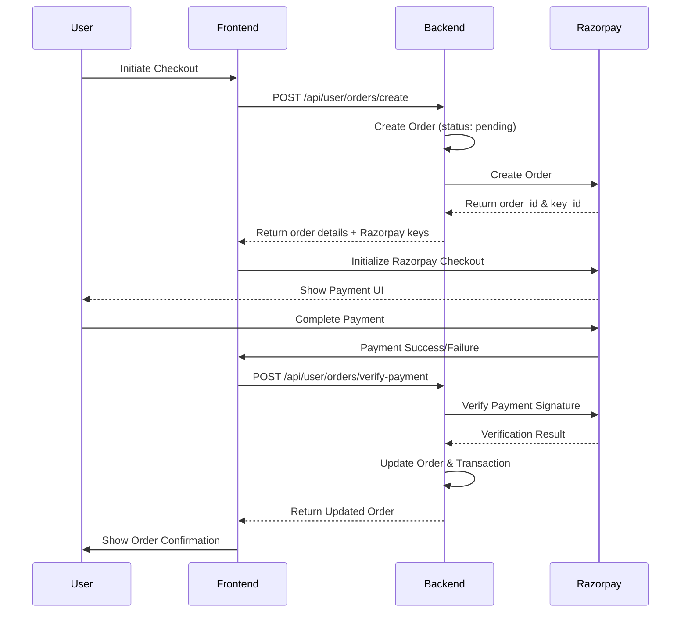

# Razorpay Integration Implementation Plan

## Overview

Integrate Razorpay payment gateway for online payments in the e-commerce platform. The implementation includes backend payment processing, order creation API, frontend Razorpay checkout integration, and proper payment verification.

## Architecture Flow




## Implementation Steps

### 1. Backend Dependencies

- Install `razorpay` package in backend
- File: `backend/package.json`

### 2. Backend Models Update

#### Order Model (`backend/models/Order.model.js`)

- Add fields:
- `razorpayOrderId` (String) - Razorpay order ID
- `razorpayPaymentId` (String) - Razorpay payment ID after successful payment
- `razorpaySignature` (String) - Payment signature for verification
- Keep existing `paymentMethod` enum, add 'razorpay' as option or map online methods to razorpay

#### Transaction Model (`backend/models/Transaction.model.js`)

- Add fields:
- `razorpayOrderId` (String)
- `razorpayPaymentId` (String)
- `razorpaySignature` (String)
- `paymentGateway` (String, default: 'razorpay')

### 3. Backend Services

#### Razorpay Service (`backend/services/razorpay.service.js`)

Create new service with methods:

- `initializeRazorpay()` - Initialize Razorpay instance with keys
- `createOrder(amount, currency, receipt)` - Create order in Razorpay
- `verifyPayment(orderId, paymentId, signature)` - Verify payment signature
- `capturePayment(paymentId, amount)` - Capture payment (if needed)
- `getPaymentDetails(paymentId)` - Get payment details from Razorpay

#### Order Service (`backend/services/order.service.js`)

Create new service with methods:

- `createOrder(orderData)` - Create order in database
- `updateOrderPayment(orderId, paymentData)` - Update order with payment details
- `getOrderById(orderId, userId)` - Get order by ID
- `getUserOrders(userId, filters)` - Get all orders for a user

### 4. Backend Controllers

#### Order Controller (`backend/controllers/user-controllers/order.controller.js`)

Create new controller with:

- `createOrder` - Create order and initialize Razorpay payment
- `verifyPayment` - Verify Razorpay payment and update order
- `getOrderById` - Get single order details
- `getUserOrders` - Get all orders for authenticated user
- `cancelOrder` - Cancel pending order

### 5. Backend Routes

#### Order Routes (`backend/routes/order.routes.js`)

Create new route file:

- `POST /api/user/orders/create` - Create order
- `POST /api/user/orders/verify-payment` - Verify payment
- `GET /api/user/orders` - Get user orders
- `GET /api/user/orders/:orderId` - Get order by ID
- `POST /api/user/orders/:orderId/cancel` - Cancel order

Update `backend/server.js` to include order routes.

### 6. Frontend Dependencies

#### Razorpay SDK Integration

- Option 1: Use CDN script tag in `frontend/index.html`
- Option 2: Install `react-razorpay` package (if available)
- Recommended: CDN approach for simplicity

### 7. Frontend Services

#### Payment Service (`frontend/src/shared/services/paymentService.js`)

Create service with:

- `initializeRazorpayCheckout(options)` - Initialize Razorpay checkout
- `handlePaymentSuccess(response)` - Handle successful payment
- `handlePaymentError(error)` - Handle payment error

#### Order Service (`frontend/src/shared/services/orderService.js`)

Create service with:

- `createOrder(orderData)` - Create order via API
- `verifyPayment(orderId, paymentData)` - Verify payment via API
- `getOrderById(orderId)` - Get order details
- `getUserOrders(filters)` - Get user orders

### 8. Frontend Store Updates

#### Order Store (`frontend/src/shared/store/orderStore.js`)

- Update `createOrder` to call backend API instead of local storage
- Add methods:
- `createOrderAPI(orderData)` - Create order via API
- `verifyPaymentAPI(orderId, paymentData)` - Verify payment
- `fetchUserOrders()` - Fetch orders from backend
- `fetchOrderById(orderId)` - Fetch single order

### 9. Frontend Checkout Pages Update

#### Mobile Checkout (`frontend/src/modules/UserApp/pages/Checkout.jsx`)

- Update payment method selection to show "Pay Online" option
- When user selects online payment (card/UPI/wallet):
- Call backend API to create order
- Get Razorpay order details
- Initialize Razorpay checkout
- Handle payment success/failure callbacks
- Call verify payment API
- Redirect to order confirmation

#### Web Checkout (`frontend/src/modules/UserWeb/pages/Checkout.jsx`)

- Apply same changes as mobile checkout

### 10. Environment Variables

#### Backend `.env`

Add:

```javascript
RAZORPAY_KEY_ID=your_key_id_here
RAZORPAY_KEY_SECRET=your_key_secret_here
RAZORPAY_WEBHOOK_SECRET=your_webhook_secret_here (optional)
```


#### Frontend `.env` or `.env.local`

Add:

```javascript
VITE_RAZORPAY_KEY_ID=your_key_id_here
```


### 11. Payment Flow Logic

1. User selects online payment method in checkout
2. Frontend sends order data to backend
3. Backend creates order with status 'pending' and paymentStatus 'pending'
4. Backend creates Razorpay order and returns order_id + key_id
5. Frontend initializes Razorpay checkout with order_id
6. User completes payment in Razorpay UI
7. Razorpay returns payment response
8. Frontend sends payment data to backend for verification
9. Backend verifies payment signature with Razorpay
10. Backend updates order status and creates transaction record
11. Frontend redirects to order confirmation page

### 12. Error Handling

- Handle Razorpay initialization errors
- Handle payment failure scenarios
- Handle network errors during verification
- Provide user-friendly error messages
- Log errors for debugging

### 13. Security Considerations

- Never expose Razorpay key_secret in frontend
- Always verify payment signature on backend
- Use HTTPS in production
- Validate order amount before payment
- Implement proper error handling
- Add rate limiting for order creation

## Files to Create

### Backend

1. `backend/services/razorpay.service.js`
2. `backend/services/order.service.js`
3. `backend/controllers/user-controllers/order.controller.js`
4. `backend/routes/order.routes.js`

### Frontend

1. `frontend/src/shared/services/paymentService.js`
2. `frontend/src/shared/services/orderService.js`

## Files to Modify

### Backend

1. `backend/package.json` - Add razorpay dependency
2. `backend/models/Order.model.js` - Add Razorpay fields
3. `backend/models/Transaction.model.js` - Add Razorpay fields
4. `backend/server.js` - Add order routes

### Frontend

1. `frontend/index.html` - Add Razorpay script (if using CDN)
2. `frontend/package.json` - (if using npm package instead of CDN)
3. `frontend/src/shared/store/orderStore.js` - Update to use API
4. `frontend/src/modules/UserApp/pages/Checkout.jsx` - Integrate Razorpay
5. `frontend/src/modules/UserWeb/pages/Checkout.jsx` - Integrate Razorpay

## Testing Checklist

- [ ] Order creation with online payment method
- [ ] Razorpay checkout initialization
- [ ] Payment success flow
- [ ] Payment failure handling
- [ ] Payment verification on backend
- [ ] Order status update after payment
- [ ] Transaction record creation
- [ ] COD flow (should remain unchanged)
- [ ] Error handling for network issues
- [ ] Order cancellation for pending orders

## Notes

- COD (Cash on Delivery) orders will continue to work without Razorpay
- Payment methods: creditCard, debitCard, upi, wallet will use Razorpay
- Payment method: cash/cod will not trigger Razorpay